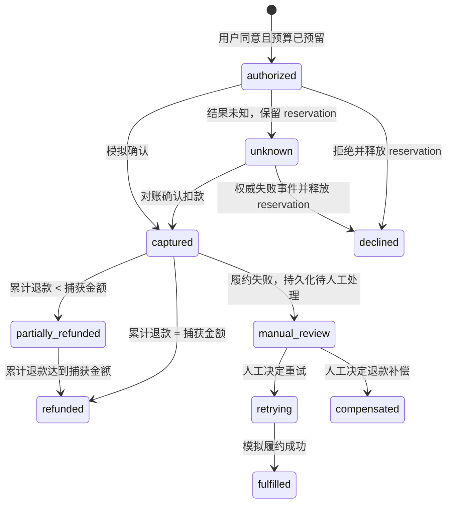

# 模拟架构、状态机与运行手册

## 设计与数据边界

这是 Node.js 原生 HTTP 服务和静态页面，无第三方运行依赖。HTTP 服务只绑定 `127.0.0.1`。变更请求要求 JSON 且拒绝跨源 Origin。商品目录、金额、用户/任务标识皆为合成样本；授权服务不接收卡号或支付凭证。JSON 状态文件 `data/state.json` 在每次状态改变时以临时文件原子替换方式持久化，权限仅用于单机演示，不适合并发多进程、网络暴露或生产。

模块边界：

- `src/catalog.js`：只读固定报价、逐币种精度和初始合成预算。
- `src/agent.js`：确定性离线脚本 planner、结构化报价建议校验和只允许 `request_quote` 的 action；生产默认不接 LLM。`createAppServer({ planner })` 可注入测试 mock contract，不配置或启动真实模型。
- `src/identity.js`：仅供演示的固定 persona 注册表，分别签发短期 agent 或 human bearer token；human token 需从同源本地审核页显式申请。无生产认证、Entra 或 OAuth。
- `src/protocol.js`：固定旅行指南报价的 HTTP 402-shaped challenge，不宣称完整 MPP/x402 兼容。
- `src/authority.js`：授权签发、范围校验、单次消费、预算 reservation、幂等、退款上限与单调支付事件。
- `src/server.js`：本地 API、状态持久化、静态页面服务；状态操作采用复制后提交，以避免验证/持久化失败时留下半更新内存态。
- `public/`：用户显式确认的浏览器交互和 `SIMULATED · OFFLINE` 提示；没有 provider SDK。

### 状态与恢复



模拟 API 将已知成功直接记为 `captured`；`unknown` 代表本地支付尝试结果尚不确定并保留预算，不会再创建第二笔交易。演示对账 endpoint 模拟确认 captured；未知结果的失败分支由带事件 ID 的 `declined` 事件展示并释放 reservation。Terminal 状态和重复事件不追加重复效果。

授权字段：owner、task、quote ID、merchant ID、商品明细、金额（整数最小货币单位）、币种、报价版本、签发/过期时间、撤销状态、一次性使用状态。付款验证所有关联范围；只允许预定义的本地 outcome。幂等键绑定请求指纹，不同请求复用同一键会拒绝。每个币种分别扣减/退款，不做汇率换算。

## 身份与 API 边界

`POST /api/demo/session` 仅接受固定 persona `alex` 或 `sam`，只返回短期内存态 agent bearer token。独立人工审核界面需显式从同源浏览器调用 `POST /api/demo/human-session` 才会获得单独的 human bearer token。API 从 token 映射取得 subject、tenant 和 role，忽略请求方提供身份的可能性并拒绝 `ownerId`、`tenantId`、`subject` 字段。Alex 与 Sam 有隔离记录和独立预算；读请求只返回当前身份可见数据。Human token 才能批准/拒绝 consent、批准退款、执行履约人工处理及 reset；agent 工具不能授予自身付款权限。该 registry 是本地演示隔离，不是可靠身份验证或 Entra/OAuth 实现。

创建任务必须显式传入 `budgetLimit: { currency, amountMinor }`。自由文本目标不被解析为支出政策；planner 的报价建议限于任务限额币种。authority 按同一 task 汇总已捕获金额和仍有效的 consent reservation，防止多个订单分别低于限额但累计超额；账户级余额仍另行校验。退款不会返还 task cap，且币种间没有换算。

| 类型 | API 路径示例 | 作用与角色 |
|---|---|---|
| Connector facade | `/api/commerce/v1/catalog`, `/tasks`, `/tasks/{id}`, `/tasks/{id}/actions`, `/consent-requests`, `/status`, `/refund-requests` | Agent 发现目录、创建任务、请求既有建议中的报价、请求人工批准及有界退款；不含批准、支付执行、预算编辑或凭证操作。详见 [connector 与本地 walkthrough](copilot-studio-connector.md)。 |
| Human facade | `/api/commerce/v1/consent-requests/{id}/approve`, `/deny`, `/refund-requests/{id}/approve` | 独立本地人工界面使用 human role；批准按精确报价快照绑定任务、商户、商品、金额、币种、版本和有效期。 |
| Constrained workflow | `/api/commerce/v1/consents/{id}/execute`, `/payments/{id}/reconcile`, `/payments/{id}/fulfill`, `/payments/{id}/fulfillment/*`, `/payments/{id}/refund`, `/resources/travel-guide` | 仅限 owner/tenant 范围的 consent/payment；authority 执行幂等状态转换。typed resource `POST` 首次返回绑定 task 和条款的 HTTP 402 challenge；approval 绑定该 challenge，后续 retry 才捕获付款并返回合成内容与收据。此为本地协议形状模拟，并非完整 MPP/x402。 |
| Compatibility API | `/api/tasks`, `/api/consents`, `/api/payments/*`, `/api/resources/*`, `/api/state`, `/api/reset` | 为原演示 E2E 保留的本地路径；同样需要 bearer token、服务端绑定身份及角色约束。新 connector 不公开这些路径。 |

请求正文中仍需提供任务、报价、consent、payment 或幂等键等业务标识，但不能自选身份。API 返回未认证、角色不足、越权或范围不匹配错误；不能用新的 key 重试以规避拒绝。

兼容 `/api/consents` 只创建 pending 人工批准请求，并不签发可执行 consent；用该 request ID 调用 `/api/payments` 会被拒绝且不产生副作用。所有网络事件模拟入口也检查 payment 的 owner/tenant。过期 pending 请求在下一次所属身份访问时持久化为 expired，重复访问及服务重启不追加重复过期事件。旧 `/api/resources/*` 的无绑定 402 仅为 compatibility challenge 展示，不代表完成付费旅程；新 UI 使用 typed facade 的 task-bound challenge。

## 快速运行

```sh
npm ci
npm run check
npm run test:e2e
npm start
```

打开 <http://127.0.0.1:4173>。先在任务表单中明确设置单币种累计上限；自由文本不是支付政策。可以依次查看周末购物和旅行/付费指南，审核具体商户和报价、手动授权、观察模拟付款与退款。旅行指南入口先记录真实本地 HTTP 402 challenge，再经独立人工批准与 challenge-bound retry 完成交付。结果未知后可点“查询模拟结果”；重启服务会从 `data/state.json` 恢复。页面的每一笔交易都不是实际授权或结算。Copilot Studio connector 本地合同、操作说明及租户接入门槛见 [connector 指南](copilot-studio-connector.md)。

## 测试覆盖

Node 内置 test runner 覆盖：

- 20 个争用者争取仅够 1 笔报价的余额时恰好 1 笔成功；预算充足时 20 笔成功。
- 实际 HTTP task/action/consent 流程中的两组 20 请求 Promise.all 付款：余额仅够 1 笔和足够 20 笔；正常付款同一幂等请求重放 10 次并在进程重启后重放。
- 23 个固定事实、参数、权限、注入、预算、拒绝和恢复向量；打印正常建议完成率、正确拒绝率、误拒绝率、重复副作用、恢复完整性、审批次数及未授权付款数。
- 默认 planner 清楚标为 offline script；注入 mock client 的合同测试接受合法建议，拒绝伪造审批/付款建议；action API 拒绝付款、批准和预算扩张。
- 旅行指南 HTTP 402-shaped challenge → task proposal → 明确批准 → 幂等资源重试 → 模拟收据/交付；包括 10 次请求重放与重启后恢复。不代表完整 MPP/x402 interoperability。
- 授权跨用户、跨任务、跨商户、金额、币种、商品、报价版本篡改、撤销、过期和重复使用被拒绝。
- 付款、网络事件、履约、资源交付及退款的重复请求不重复产生副作用；退款 HTTP 请求重放 10 次且持久状态不变。
- 30 次重复对账不追加重复事件；unknown 结果在服务重启后仍可恢复。
- 迟到/乱序事件不得回退 terminal 状态；累计退款不超过捕获金额。
- 履约失败后，订单持久显示人工处理；覆盖人工重试成功和退款补偿，绝不把失败履约标记为完成。
- HTTP 静态页面、模拟标记、API 错误路径和状态持久化。

## 局限和未来适配门槛

本地单进程 synchronous JSON store 只依赖 Node event loop 保证同一实例内操作顺序，缺少跨进程数据库事务、真实密码学签名、生产用户认证、生产级 CSRF/session 管理、供应商 webhooks 验签、欺诈/法规判断、多币种 FX、可用性校验和真实清算语义。HTTP 402 仅用于展示 challenge → consent → retry → receipt 顺序，不含真实 MPP/x402 编解码、签名凭证、网络互操作或结算。浏览器中的本地人工操作不是强认证。connector JSON 与本地 HTTP 测试不表示已导入、发布或连接 Copilot Studio；云端 channel 不能访问 loopback，后续需另行批准的 HTTPS hosting、Entra/OAuth、DLP、租户和安全集成。不得把 demo 暴露公网。

未来的 PSP/wallet adapter 必须作为新的显式集成，验证供应商官方 sandbox 与凭证生命周期；确定性授权和幂等对账不可被 Agent 直接调用真实交易的通道绕过。环境配置、权限、成本、账户和用户批准应在单独的实施决策和安全审查中确定；当前仓库不包含真实 provider adapter、云部署脚本或付费模型配置。
