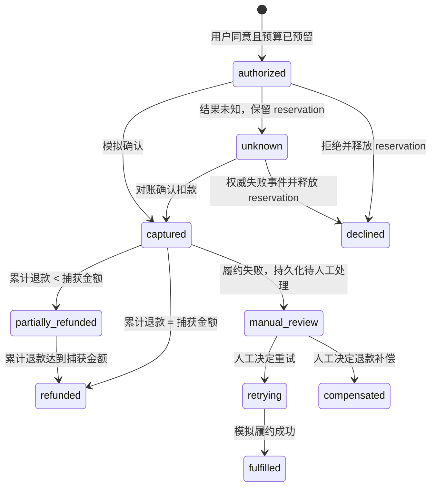

# 模拟架构、状态机与运行手册

## 设计与数据边界

这是 Node.js 原生 HTTP 服务和静态页面，无第三方运行依赖。HTTP 服务只绑定 `127.0.0.1`。变更请求要求 JSON 且拒绝跨源 Origin。商品目录、金额、用户/任务标识皆为合成样本；授权服务不接收卡号或支付凭证。JSON 状态文件 `data/state.json` 在每次状态改变时以临时文件原子替换方式持久化，权限仅用于单机演示，不适合并发多进程、网络暴露或生产。

模块边界：

- `src/catalog.js`：只读固定报价、逐币种精度和初始合成预算。
- `src/agent.js`：确定性离线脚本 planner、结构化报价建议校验和只允许 `request_quote` 的 action；生产默认不接 LLM。`createAppServer({ planner })` 可注入测试 mock contract，不配置或启动真实模型。
- `src/protocol.js`：固定旅行指南报价的 HTTP 402-shaped challenge，不宣称完整 MPP/x402 兼容。
- `src/authority.js`：授权签发、范围校验、单次消费、预算 reservation、幂等、退款上限与单调支付事件。
- `src/server.js`：本地 API、状态持久化、静态页面服务；状态操作采用复制后提交，以避免验证/持久化失败时留下半更新内存态。
- `public/`：用户显式确认的浏览器交互和 `SIMULATED · OFFLINE` 提示；没有 provider SDK。

### 状态与恢复



模拟 API 将已知成功直接记为 `captured`；`unknown` 代表本地支付尝试结果尚不确定并保留预算，不会再创建第二笔交易。演示对账 endpoint 模拟确认 captured；未知结果的失败分支由带事件 ID 的 `declined` 事件展示并释放 reservation。Terminal 状态和重复事件不追加重复效果。

授权字段：owner、task、quote ID、merchant ID、商品明细、金额（整数最小货币单位）、币种、报价版本、签发/过期时间、撤销状态、一次性使用状态。付款验证所有关联范围；只允许预定义的本地 outcome。幂等键绑定请求指纹，不同请求复用同一键会拒绝。每个币种分别扣减/退款，不做汇率换算。

## API

所有端点仅供本机实验，不提供生产身份验证。

| 方法与路径 | 用途 |
|---|---|
| `GET /api/state` | 读取本地样本报价、余额、授权、付款和事件 |
| `POST /api/tasks` | 由离线脚本生成结构化报价建议，不进行模型推理 |
| `GET /api/tasks/:id?ownerId=...` | 读取所属用户的任务和建议 |
| `POST /api/tasks/:id/actions` | 只允许幂等、任务范围内的 `request_quote` |
| `POST /api/consents` | 根据已创建任务的建议和用户批准，生成 15 分钟限范围授权 |
| `POST /api/consents/revoke` | 撤销尚未消费的本地授权 |
| `POST /api/payments` | 用授权、幂等键和模拟 outcome 发起一次本地交易 |
| `POST /api/resources/travel-guide` | 无授权时返回 HTTP 402-shaped challenge；批准后重试，返回固定合成资源和模拟收据 |
| `POST /api/payments/reconcile` | 对 unknown 交易执行一次本地 simulated capture 对账 |
| `POST /api/payments/fulfill` | 为已捕获付款生成模拟履约状态；重复请求不追加副作用 |
| `POST /api/payments/fulfillment/fail` | 模拟履约失败并保存待人工处理状态 |
| `POST /api/payments/fulfillment/resolve` | 人工决定重试履约或执行补偿退款 |
| `POST /api/payments/events` | 应用带 event ID 的 captured/declined/authorized 模拟事件 |
| `POST /api/payments/refund` | 在 captured 金额内执行幂等模拟退款 |
| `POST /api/reset` | 删除本地 demo 交易并恢复初始样本预算 |

付款请求中的 `ownerId`、`taskId`、`consentId`、`idempotencyKey` 必需；报价字段若提供，必须与固定报价一致。拒绝返回结构化 400 错误，不应重试为新交易。

## 快速运行

```sh
npm ci
npm run check
npm run test:e2e
npm start
```

打开 <http://127.0.0.1:4173>。可以依次查看周末购物和旅行/付费指南，审核具体商户和报价、手动授权、观察模拟付款与退款。结果未知后可点“查询模拟结果”；重启服务会从 `data/state.json` 恢复。页面的每一笔交易都不是实际授权或结算。

## 测试覆盖

Node 内置 test runner 覆盖：

- 20 个争用者争取仅够 1 笔报价的余额时恰好 1 笔成功；预算充足时 20 笔成功。
- 实际 HTTP task/action/consent 流程中的两组 20 请求 Promise.all 付款：余额仅够 1 笔和足够 20 笔；正常付款同一幂等请求重放 10 次并在进程重启后重放。
- 23 个固定事实、参数、权限、注入、预算、拒绝和恢复向量；打印正常建议完成率、正确拒绝率、误拒绝率、重复副作用、恢复完整性、审批次数及未授权付款数。
- 默认 planner 清楚标为 offline script；注入 mock client 的合同测试接受合法建议，拒绝伪造审批/付款建议；action API 拒绝付款、批准和预算扩张。
- 旅行指南 HTTP 402-shaped challenge → task proposal → 明确批准 → 幂等资源重试 → 模拟收据/交付；包括 10 次请求重放与重启后恢复。不代表完整 MPP/x402 interoperability。
- 授权跨用户、跨任务、跨商户、金额、币种、商品、报价版本篡改、撤销、过期和重复使用被拒绝。
- 付款、网络事件、履约、资源交付及退款的重复请求不重复产生副作用；退款 HTTP 请求重放 10 次且持久状态不变。
- 30 次重复对账不追加重复事件；unknown 结果在服务重启后仍可恢复。
- 迟到/乱序事件不得回退 terminal 状态；累计退款不超过捕获金额。
- 履约失败后，订单持久显示人工处理；覆盖人工重试成功和退款补偿，绝不把失败履约标记为完成。
- HTTP 静态页面、模拟标记、API 错误路径和状态持久化。

## 局限和未来适配门槛

本地单进程 synchronous JSON store 只依赖 Node event loop 保证同一实例内操作顺序，缺少跨进程数据库事务、真实密码学签名、用户认证、CSRF/session 管理、供应商 webhooks 验签、欺诈/法规判断、多币种 FX、可用性校验和真实清算语义。HTTP 402 仅用于展示 challenge → consent → retry → receipt 顺序，不含真实 MPP/x402 编解码、签名凭证、网络互操作或结算。浏览器中的 confirm 只是模拟用户批准，不是强认证。不得把 demo 暴露公网。

未来的 PSP/wallet adapter 必须作为新的显式集成，验证供应商官方 sandbox 与凭证生命周期；确定性授权和幂等对账不可被 Agent 直接调用真实交易的通道绕过。环境配置、权限、成本、账户和用户批准应在单独的实施决策和安全审查中确定；当前仓库不包含真实 provider adapter、云部署脚本或付费模型配置。
