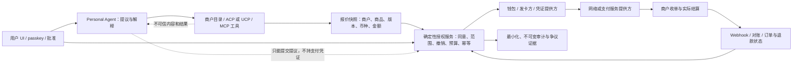

# Agentic Commerce：Personal Agent 的商业价值与支付原生架构

**研究截点：2026-10-09。** 本文区分 Stripe 发布日公告、当前在线产品文档、Visa 产品工作流说明、开放协议文档、固定 Git commit 的代码观察，以及本仓库自己的离线模拟。供应商页面会持续变化；本报告不是法律意见、产品资格保证或支付认证。

## 执行摘要

Agentic Commerce 不只是“让 LLM 点购买按钮”，而是把发现、协商、委托、授权、支付、履约、售后和争议证据连接起来。关键架构原则是：**模型可生成候选意图，但不得成为授权事实的唯一来源。** 支付边界必须由独立、可测试的权限层检查用户、任务、商户、商品、金额、币种、有效期、预算和一次性执行状态；支付凭证由钱包/发卡方/网络控制，不进入提示词或通用工具上下文。

生态不存在一条所有参与方都必须采用的协议栈。目录与购物、Agent 互操作、用户付款意图、可信代理识别、短时支付凭证和结算是不同层次。ACP/UCP、MCP/A2A、AP2、Visa TAP/VIC、SPT、MPP 和 x402 可以在不同参与方和场景中组合或竞争；不能把协议互操作误说成资金结算，也不能把 2026 年发布日演示统一表述为 GA。

## 1. 商业价值链与场景

| 环节 | 消费者/Personal Agent 价值 | 商户、平台与支付方价值 | 需要控制的风险 |
|---|---|---|---|
| 意图和发现 | 将自然语言目标拆为可检查条件 | 新入口、目录可发现性 | 误解需求、伪造商品、隐私过度收集 |
| 比较和协商 | 跨商户比较价格、可用性、退改政策 | 更高意向流量、结构化商品信息 | 过期价格、虚假评价、赞助排序 |
| 委托和报价 | 按任务、预算、类别与时限授予有限权限 | 降低结账摩擦 | 模型提示注入、越权、报价变化 |
| 批准和付款 | 明确批准具体订单，必要时 passkey/step-up | 可信订单、更丰富的风控信号 | 重放、重复提交、凭证泄露、争议 |
| 履约和售后 | 自动跟踪、改签、取消和退款 | 更低服务成本、闭环状态 | 部分履约、幂等、退款重复、责任归属 |
| 按次数字服务 | 小额付费 API、内容、工具或计算资源 | 机器消费的新计量收入 | 未授权连续消费、汇率/费率误解、微支付成本 |

**适合 Personal Agent 的原型场景**

1. **周末多商户采购：** 代理按照用户预算与偏好筛选装备、食品、交通等报价；每个商户、商品集合和总金额分别确认，用户可撤销尚未执行的授权。
2. **旅行预订：** 报价时绑定日期、旅客、币种、退改规则及最终金额；酒店、交通等拆分授权，库存或价格改变即要求重新批准。
3. **付费信息/工具：** 以明确单次价格为边界购买实时指南或 API 结果；订阅、预付余额、持续计量是不同授权，不应由单次授权自动推断。
4. **售后代理：** 只能对原订单发起查询、取消或不超过已扣款的退款申请；退款决定、退款执行和银行入账需分别表述。

商业价值应通过可量化指标验证：用户完成任务时间、价格/政策透明度、转化与放弃率、误购率、退款/争议率、授权范围偏差、每笔成功交易的服务成本。不能仅凭一次成功 demo 宣称收入增量或风控提升。

## 2. AI 职责与信任边界

**可交给 AI 的工作：** 自然语言解析、商品语义检索、偏好排序、比较说明、报价变化摘要、拟定取消/退款请求、对账异常分类。模型输出属于建议，输入的网页、商户文案和工具结果都视为不可信数据。

**必须由确定性系统和用户/受信任支付方掌握的工作：**

- 建立和验证授权：签发主体、用户、任务、商户、商品、精确整数最小货币单位、币种、报价版本、时限和可执行次数。
- 风险触发的重新认证、撤销、预算 reservation、幂等、并发仲裁、退款限额及最终状态机。
- 机密支付凭证的签发、存储和传递；模型不接触 PAN/CVV、支付 token、passkey 私钥或可重放的支付凭证。
- 外部支付/清算确认与未知结果恢复；不可把超时等同成功或失败。
- 责任、合规、争议和商户履约规则的最终决定。

**AI 评估目标：** 将含混意图、注入式商户文案、金额/币种修改、过期报价、跨用户 ID、无授权退款、重放工具调用等作为对抗用例。衡量未经确定性授权的支付副作用应为零；模型的“拒绝”不是唯一安全控制。

## 3. 参考架构：以授权事实为核心，而不是协议品牌

支付原生架构需明确分开六种对象：

1. **Agent 身份/发现：** 哪个代理在和哪个商户交互；代理身份不代表用户授权。
2. **用户指令/委托：** 用户目标和可接受范围，或特定已确认订单。
3. **报价/购物车：** 商户给出的具体商品、数量、价格版本、税费、配送和退改条款。
4. **付款凭证：** 受限 token、共享支付 token、钱包授权或网络凭证；其控制者与生命周期独立于模型。
5. **资金动作：** 授权、捕获、退款、撤销、结算；每项都需单独状态和幂等键。
6. **履约/争议证据：** 用户指令、接受的报价、网络结果、商户履约与售后信号，保留必要且最小化的数据。

**安全顺序：** 报价快照 → 用户审阅并批准 → 创建一次性范围授权 → 权限层原子预留预算/检查幂等 → 钱包/PSP 发起动作 → 等待权威结果 → 对账与持久化 → 向 UI 展示实际状态。超时进入 `unknown`，不得再次创建交易；先查询/对账，再由原幂等键安全重试。报价变化、跨商户、币种改变、金额变化、用户撤销或授权过期均重新授权。

## 4. 来源产品与状态辨析

### Stripe：Sessions 2026 公告与当前文档不是同一个证据

Stripe 在 **2026-04-29 Sessions 发布日**的[公告汇总](https://stripe.com/blog/everything-we-announced-at-sessions-2026)称当天宣布 288 项产品/功能，重点包括 Agentic Commerce Suite、Meta/Google 合作、通过 UCP 与 Google 购物、Link Agent Wallet、机器支付 MPP、SPT 与 stablecoin/card 等支付方式；另包含 Checkout Studio、结账嵌入、收入计量和 Treasury 等更广的 AI 经济基础设施。本文不将每条发布日表述都外推成面向所有商户的 GA。

截至研究日的 [Stripe Agentic Commerce 文档](https://docs.stripe.com/agentic-commerce) 将能力区分为卖家、Agent、嵌入商品/跳转卖家/Agent 钱包等集成路径，并列出商品目录、结账、共享支付 token 与 MPP/x402 等组合。该文档明确写明 Agents 相关能力为 **Private preview**；可用性和申请资格应以当时账户/产品文档为准。产品名相似并不意味各路径共用同一凭证、协议或结算方式。

### Visa：VIC 生命周期与 TAP 的角色不同

Visa 官方 [VIC overview](https://developer.visa.com/capabilities/visa-intelligent-commerce/overview) 描述以下生命周期：代理接入 Visa Intelligent Commerce；用户配置代理专属 token，可添加 Visa 卡并进行 step-up 验证和 passkey 设置；代理提议采购后管理用户同意；代理用 passkey 认证 payment instruction；VIC 校验凭证请求是否匹配该 authenticated instruction 并设网络控制；代理起初通过 guest checkout/form fill 在商户付款；VisaNet 对指定商户和金额实施控制；代理回传购买结果信号，以帮助处理争议。该 overview 不足以推断 API 地域、费率、资格或上线范围。

Visa 商业入口将 VIC 定位为包含支付凭证、控制、认证与保护的 strategic portfolio；页面链接至开发者 overview 和 [Agentic Sandbox](https://developer.visaacceptance.com/hello-world/agentic-sandbox.html)。本项目只把后者列为公开参考，不执行 sandbox。

[Trusted Agent Protocol（TAP）overview](https://developer.visa.com/capabilities/trusted-agent-protocol/overview) 关注的是商户如何识别和信任购物代理：商户/用途特定、限时、不可重放或转送的签名相关规范，使代理流量可区别于恶意 bot。TAP 的可信代理信号不是付款授权，不是钱包 token，也不等价于 VIC 的用户同意与网络交易控制。

### 协议地图：分层组合，不假设唯一赢家

| 协议/能力 | 主要问题 | 不应误称为 |
|---|---|---|
| [ACP](https://www.agenticcommerce.dev/) / [UCP](https://ucp.dev/) | Agent/平台与商户间商品、购物/checkout 工作流 | 支付网络或结算承诺 |
| [MCP](https://modelcontextprotocol.io/) | 模型/应用与工具、资源的上下文和调用接口 | 用户授权或支付 rails |
| [A2A](https://a2a-protocol.org/) | Agent 之间发现/协作和任务交接 | 可信付款凭证 |
| [AP2](https://ap2-protocol.org/) | Agent 支付的用户意图与可验证 mandate 概念 | 资金结算网络 |
| Visa [TAP](https://developer.visa.com/capabilities/trusted-agent-protocol/overview) / [VIC](https://developer.visa.com/capabilities/visa-intelligent-commerce/overview) | 商户可信代理识别 / 用户指令、支付凭证及网络控制组合 | 通用目录或统一开放支付协议 |
| Stripe [SPT](https://docs.stripe.com/agentic-commerce/concepts/shared-payment-tokens) | 对特定 agentic checkout 场景传递受限共享支付 token | 通用 token 或独立清算系统 |
| [MPP](https://mpp.dev/) / [x402](https://x402.org/) | HTTP 402 / 机器对机器资源付费的请求与支付体验 | 传统卡收单或最终结算本身 |

应按角色、商户覆盖、用户体验、凭证风险、地域/方法、回调和争议要求决定组合；运行 MCP 工具不自动获得用户代表权，使用 A2A 不自动证明订单真实性，协议级支付凭证也不取代商户收单/清算/退款生命周期。

## 5. AWS Shopping Concierge 示例观察

固定在 [commit `3f2d283e7030743feb310e637bf4ff1cdbab5382`](https://github.com/awslabs/agentcore-samples/tree/3f2d283e7030743feb310e637bf4ff1cdbab5382/05-blueprints/shopping-concierge-agent)；以下是公开 README、部署指南及代码的只读观察，不是本项目改写或复制的依据。

- README 描述 supervisor + shopping/cart 子代理、基于 MCP 的工具、对话记忆、流式 UI、Cognito 身份、Amplify/DynamoDB 与可选 Visa tokenization/payment path。
- 固定 commit 的 `supervisor_agent/agent.py` 将 Bedrock 模型、用户资料、会话 memory manager 与购物/购物车子代理组织在 AgentCore runtime 中；这是云端多代理样例，不是离线安全认证。
- `mcp_cart_tools/server.py` 将购物车/checkout 作为 MCP 工具暴露；`request_purchase_confirmation` 形成购买摘要，而 `confirm_purchase(user_id)` 工具的调用接口本身没有消费一个授权 nonce/订单版本参数。周边系统可能仍有 UI/代理策略，不据此推断所有集成不安全；它说明仅靠 prompt 约束工具调用不能替代交易服务侧的确定性授权。
- `local-visa-server` 目录在同一 commit 存在独立 Visa 代理服务器；部署文档区分 mock 模式与需要 Visa 账户/凭证的真实集成路径。没有运行部署，亦未从该 demo 推断生产可用或 Visa 认证状态。
- 本实验室采用该示例公开体现的产品比较、购物车、旅行/商品多子代理和会话恢复问题作为**高层设计输入**，完全独立实现单机合成样本，不复制 AWS 文件、提示、UI、基础设施或实现片段。

## 6. 本实验室的实现边界

当前浏览器 demo 将用户点击确认视为本地教学 UI 的批准信号。API 中固定商品报价和授权内容由确定性代码生成；所有余额及支付结果均本地模拟，不调用模型、真实商户、Visa、Stripe、钱包、网络或云。测试通过只证明本地模拟不变量，不证明外部产品行为或线上抗攻击能力。未来如果增加 LLM，必须保持仅提议角色，且在显式配置与用户另行同意前禁用任何付费调用。
